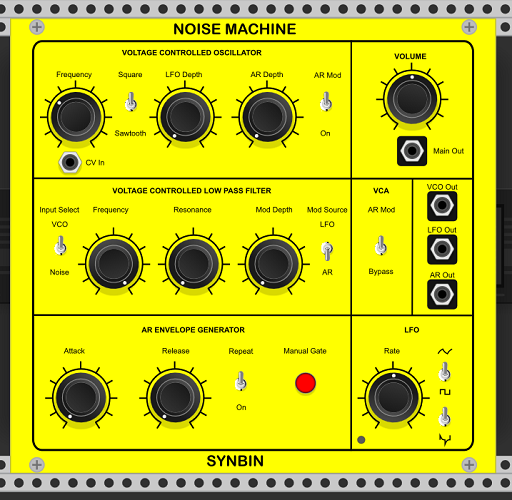

# Synbin VCV Modules
Modules for use with VCV Rack Modular Synthesizer

## Noise Machine

<<<<<<< HEAD

Based on the hardware Noise Toaster by Ray Wilson of 'Music from Outer Space'
Differences include CV In for the VCO and individual outputs for the raw VCO and LFO.

=======
Based on the hardware Noise Toaster by Ray Wilson of 'Music from Outer Space'
>>>>>>> 19f388547c0577148c0e392004cb03fb428b187f
